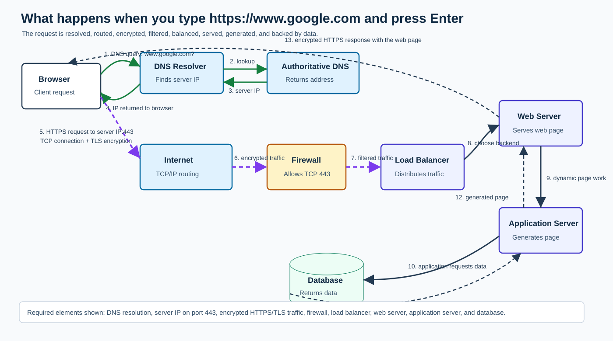

# What Happens When You Type `https://www.google.com` and Press Enter

This project explains the web infrastructure path behind a browser request, from DNS lookup through servers and databases.

## Blog Post Draft

When you type `https://www.google.com` into your browser and press Enter, a lot happens in a very short amount of time. The browser has to find Google's servers, create a network connection, secure that connection, send an HTTP request, receive a response, and then render the page for you.

This process involves DNS, TCP/IP, firewalls, HTTPS, load balancers, web servers, application servers, and databases.

## Request Flow Diagram



## 1. The Browser Parses the URL

The browser first reads the URL:

- `https` is the protocol.
- `www.google.com` is the hostname.
- No explicit path is provided, so the browser requests `/`.
- No port is provided, so the browser uses port `443`, the default port for HTTPS.

Before contacting the internet, the browser may check whether it already has cached information about this site. It can check its own cache, the operating system DNS cache, and sometimes the router or network DNS cache.

## 2. DNS Request

Computers communicate using IP addresses, but people use domain names. DNS, or Domain Name System, translates `www.google.com` into an IP address.

If the IP address is not already cached, the computer asks a DNS resolver for it. This resolver is usually provided by an ISP, a public DNS service, or a company network.

The resolver may query several DNS systems:

- A root DNS server, which points to the `.com` top-level domain servers.
- A `.com` DNS server, which points to Google's authoritative DNS servers.
- Google's authoritative DNS server, which returns the IP address for `www.google.com`.

The result is returned to the browser and cached for a limited time based on the DNS record's TTL, or time to live.

## 3. TCP/IP Connection

Once the browser has an IP address, it opens a connection to Google's server using TCP over IP.

IP is responsible for moving packets between your machine and the destination server. Packets may travel through many routers across different networks before reaching Google.

TCP provides a reliable connection on top of IP. It makes sure packets arrive in order, detects missing packets, and retransmits data when needed.

Before data can be sent, TCP performs a three-way handshake:

1. The browser sends a `SYN` packet.
2. The server replies with a `SYN-ACK` packet.
3. The browser sends an `ACK` packet.

After this handshake, the TCP connection is open.

## 4. Firewall Checks

As packets move between your browser and Google, they may pass through several firewalls.

Your computer may have a local firewall that controls outgoing and incoming traffic. Your home router, company network, ISP, or cloud provider may also have firewall rules.

Firewalls inspect traffic metadata such as source IP, destination IP, protocol, and port. Since HTTPS uses port `443`, the firewall must allow outbound TCP traffic to that port. On Google's side, firewalls help block unwanted or suspicious traffic before it reaches internal systems.

## 5. HTTPS and SSL/TLS

Because the URL uses `https`, the browser must secure the connection using TLS, which is the modern successor to SSL.

During the TLS handshake, the browser and server agree on encryption settings. The server sends a digital certificate that proves it owns `www.google.com`. The browser verifies that certificate using trusted certificate authorities installed in the browser or operating system.

If the certificate is valid, the browser and server negotiate shared encryption keys. After that, HTTP data is encrypted before it travels across the network.

This protects the request and response from being read or modified by attackers in transit.

## 6. HTTP Request

After the secure connection is ready, the browser sends an HTTP request. A simplified version might look like this:

```http
GET / HTTP/1.1
Host: www.google.com
User-Agent: Browser information
Accept: text/html
```

This request asks Google for the home page. It also includes headers that describe the browser, accepted content types, cookies, language preferences, and other request details.

## 7. Load Balancer

Google does not rely on a single server for `www.google.com`. It uses many servers across many locations.

A load balancer receives incoming traffic and decides which backend server should handle each request. It may consider server health, geographic location, current traffic, latency, and capacity.

Load balancing improves availability and performance. If one server is unhealthy or overloaded, traffic can be routed to another server.

## 8. Web Server

The request eventually reaches a web server. A web server handles HTTP-level communication. It receives the request, reads headers, manages connections, and returns HTTP responses.

For static assets such as images, CSS, JavaScript, or cached HTML, the web server may return content directly. If the request needs dynamic processing, the web server forwards it to an application server.

## 9. Application Server

The application server runs the business logic. For a search engine, this could include reading cookies, checking user preferences, deciding which localized page to show, handling authentication state, and preparing dynamic content.

The application server creates the response that the user should receive. It may call other internal services and may need information from storage systems.

## 10. Database

If the application needs stored data, it communicates with a database or another storage system.

For Google, this does not mean one small database. Large systems use distributed storage, caches, indexes, and many internal services. Still, the general idea is the same: the application asks for data, the data layer returns results, and the application uses that data to build the response.

Databases may store user settings, account data, search indexes, logs, configuration, and other information needed to serve the request.

## 11. The Response Returns to the Browser

After the server prepares the response, it sends it back through the same secure connection. The response includes an HTTP status code, headers, and a body.

For example, the server may return:

- `200 OK` if the page was served successfully.
- HTML content for the page.
- Headers for caching, security, cookies, compression, and content type.

The browser decrypts the response, reads the HTML, and starts rendering the page.

## 12. Rendering the Page

The browser parses the HTML and builds the DOM. It also downloads linked resources such as CSS, JavaScript, fonts, and images. CSS is used to build the visual style, and JavaScript may modify the page or request more data.

The browser combines the DOM and CSSOM, calculates layout, paints pixels, and displays the final page.

## Conclusion

Typing `https://www.google.com` and pressing Enter feels simple, but it triggers a full chain of web infrastructure systems. DNS finds the correct IP address. TCP/IP creates reliable communication. Firewalls filter traffic. HTTPS protects the connection. Load balancers distribute requests. Web servers and application servers process the request. Databases and storage systems provide data. Finally, the browser renders the response into the page you see.

Understanding this flow is important because it connects many layers of software engineering: networking, security, backend systems, distributed infrastructure, and frontend rendering.
